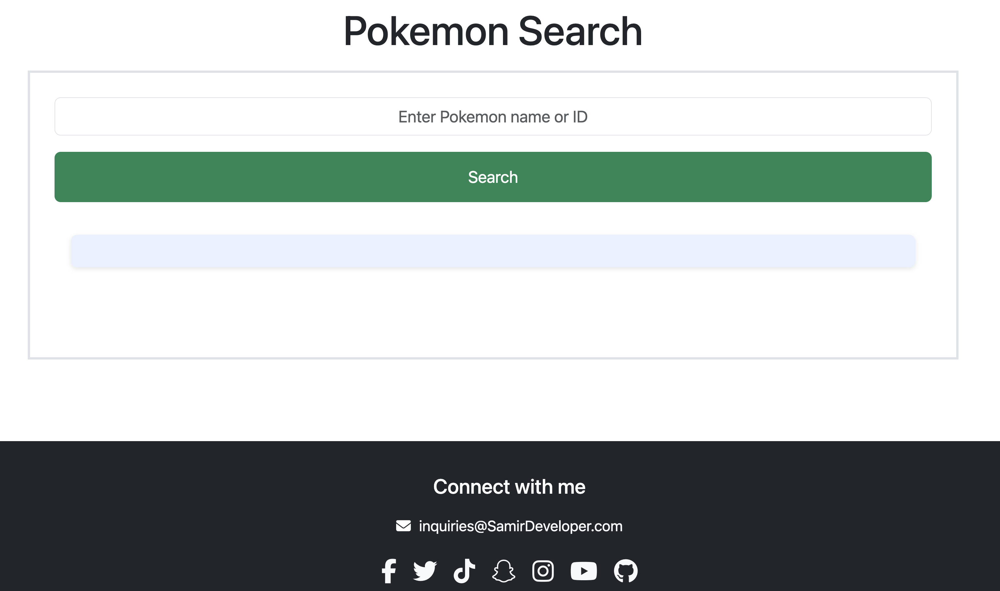

<h1 align="center">Pokémon Search App 🔍</h1>

A simple web app that lets users search for Pokémon by name or ID and view their basic details using the PokéAPI.

## 🚀 Features

- Search Pokémon by **name** or **ID**
- Fetch data from the [PokéAPI](https://pokeapi.co/)
- Display:
  - Pokémon name (with proper capitalization)
  - Official sprite image
  - All available types (e.g., `fire`, `flying`)

## 🛠 Technologies Used

- HTML5
- CSS3
- [Bootstrap 5.3](https://getbootstrap.com/)
- JavaScript (ES6+)
- [PokéAPI](https://pokeapi.co/)

### 🚀 Live Site  

## 🧑‍💻 How to Use

1. Clone or download the project.
2. Open `index.html` in your browser.
3. Type a Pokémon **name** (e.g., `pikachu`) or **ID** (e.g., `25`) into the input box.
4. Press the **Search button** or hit **Enter**.
5. View the Pokémon's name, image, and types.

## ✅ Example Inputs

- `"bulbasaur"`
- `"150"` (for Mewtwo)
- `"eevee"`
- `"charizard"`

## 📸 Screenshot

  

## 🔧 Future Improvements

- Display Pokémon height, weight, and abilities
- Add search history or favorites

## 📚 Learning Goals

- Practice DOM manipulation in JavaScript
- Work with public APIs (fetching and parsing data)
- Handle user input and errors gracefully
- Apply basic Bootstrap layout and styling

---

## 🌐 Portfolio

Check out more of my work at:  
🔗 [samirdeveloper.com](https://samirdeveloper.com)

---

Created by Samir Developer
